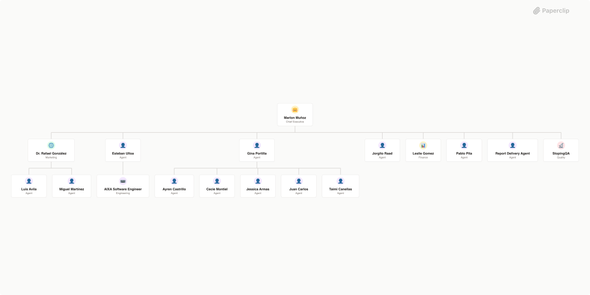

# Las Mercedes Healthcare Group



## What's Inside

> This is an [Agent Company](https://agentcompanies.io) package from [Paperclip](https://paperclip.ing)

| Content | Count |
|---------|-------|
| Agents | 17 |
| Projects | 1 |
| Skills | 13 |

### Agents

| Agent | Role | Reports To |
|-------|------|------------|
| AIXA Software Engineer | Engineer | esteban-ulloa |
| Ayren Castrillo | general | gina-portilla |
| Cecie Montiel | general | gina-portilla |
| Dr. Rafael González | CMO | marlon-mu-oz |
| Esteban Ulloa | general | marlon-mu-oz |
| Gina Portilla | general | marlon-mu-oz |
| Jessica Armas | general | gina-portilla |
| Jorgito Raad | general | marlon-mu-oz |
| Juan Carlos | general | gina-portilla |
| Leslie Gomez | CFO | marlon-mu-oz |
| Luis Avila | general | dr-rafael-gonz-lez |
| Marlon Muñoz | CEO | — |
| Miguel Martínez | general | dr-rafael-gonz-lez |
| Pablo Pita | general | marlon-mu-oz |
| Report Delivery Agent | general | marlon-mu-oz |
| StopingQA | qa | marlon-mu-oz |
| Taimi Canellas | general | gina-portilla |

### Projects

- **AIXA Integration & Operations.** — Configuración e integración de todos los departamentos de Las Mercedes Healthcare Group con la plataforma AIXA vía Paperclip. Incluye sincronización de agentes, conexión a módulos MCP, pipeline de reportes (QA + Report Delivery), y rutinas automatizadas.

### Skills

| Skill | Description | Source |
|-------|-------------|--------|
| aixa-clinical | — | catalog |
| aixa-maintenance | — | catalog |
| aixa-pharmacy | — | catalog |
| aixa-referrals | — | catalog |
| aixa-sales | — | catalog |
| outlook-las-mercedes | — | catalog |
| qa-gate | — | catalog |
| report-delivery | — | catalog |
| paperclip-create-agent | > | [github](https://github.com/paperclipai/paperclip/tree/master/skills/paperclip-create-agent) |
| paperclip-create-plugin | > | [github](https://github.com/paperclipai/paperclip/tree/master/skills/paperclip-create-plugin) |
| paperclip | > | [github](https://github.com/paperclipai/paperclip/tree/master/skills/paperclip) |
| para-memory-files | > | [github](https://github.com/paperclipai/paperclip/tree/master/skills/para-memory-files) |
| second-brain | > | [github](https://github.com/paperclipai/paperclip/tree/master/skills/second-brain) |

## Getting Started

```bash
pnpm paperclipai company import this-github-url-or-folder
```

See [Paperclip](https://paperclip.ing) for more information.

---
Exported from [Paperclip](https://paperclip.ing) on 2026-05-14
